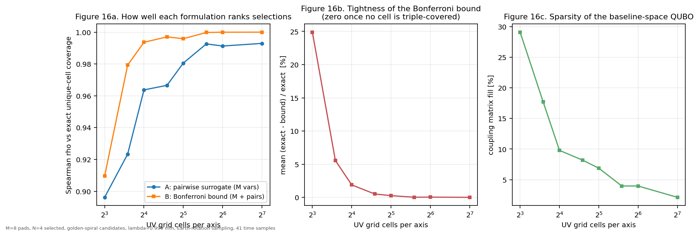
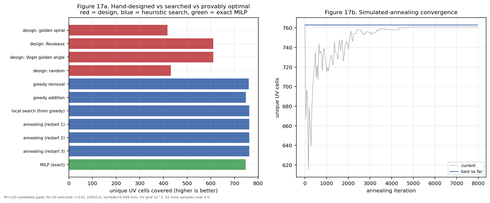
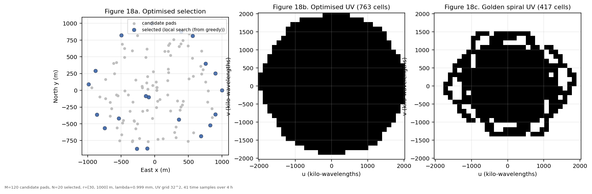
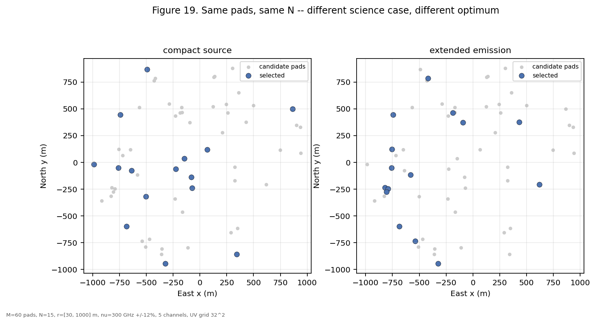
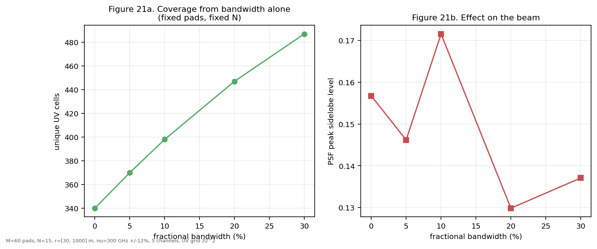
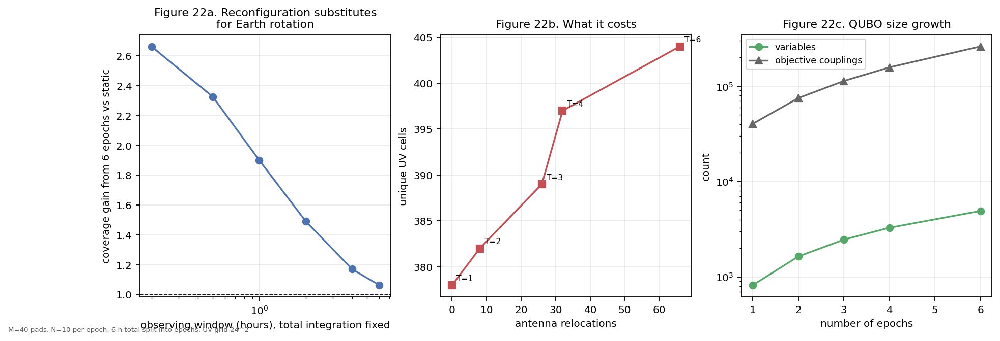
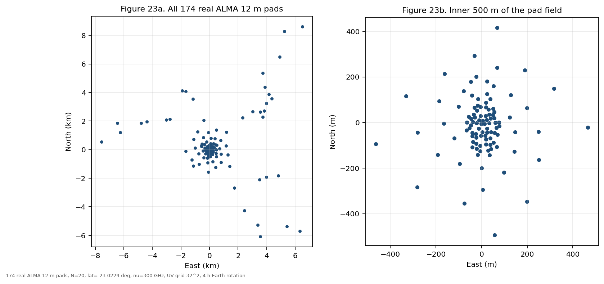
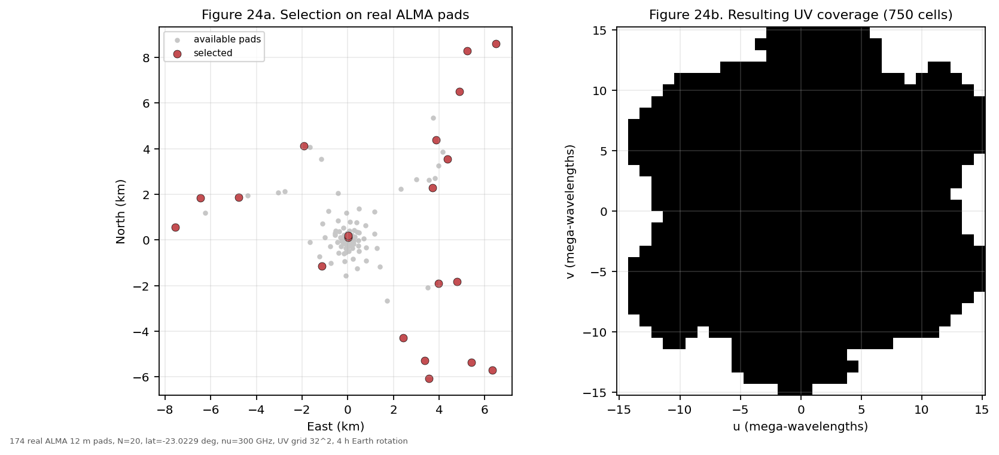

# Atmosphere-Aware QUBO Formulations for Discrete-Pad Terahertz Interferometric Array Design

**Manasa Vamsi**

> Submission metadata still required: institutional affiliation, correspondence
> email, ISRO Space Applications Centre coauthor information, funding statement,
> acknowledgements, and repository DOI. Section 4.7 uses the published ALMA pad
> coordinates together with measured phase-stability and water-vapour statistics
> for that site; the controlled studies in Sections 4.1 to 4.6 use synthetic
> candidate pads. This is a methods study, not a site-specific build
> recommendation.

## Abstract

Selecting a subset of prepared antenna pads for a sub-millimetre or terahertz
interferometer is combinatorial: an array of N antennas selected from M
candidate pads has C(M,N) feasible layouts, while the imaging response depends
on antenna pairs. This study formulates discrete-pad selection as a quadratic
unconstrained binary optimization (QUBO) problem while retaining useful
Fourier-plane objectives. UV-track overlap is quartic in pad-selection
variables. The formulation resolves this by introducing one
baseline-activation variable per candidate pair and enforcing its product
relation through Rosenberg quadratization. This provides exact quadratic forms
for gridded sampling-density energy, UV-point repulsion, and target-density
matching. A second-order Bonferroni objective provides a sparse, provable lower
bound on unique-cell coverage. Fixed antenna count, minimum separation, and a
tropospheric coherence penalty are also quadratic. Across exhaustive M=8,
N=4 tests, the baseline-variable formulation selected an exact-coverage
optimum at every tested UV resolution, whereas a pad-only surrogate missed it
at four of eight resolutions. In a controlled Earth-rotation benchmark with
M=120 and N=20 synthetic pads, greedy-plus-swap and simulated annealing each
reached 763 occupied UV cells, versus 417 for a golden-spiral reference while
satisfying minimum separation. A multi-frequency simulation increased occupied
cells by 43.2% over the monochromatic case at 30% fractional bandwidth. This is
a validated classical and QUBO-compatible baseline, not a claim of quantum
advantage or a site-specific array design. Applied to the 174 published
twelve-metre ALMA pads, searched selection improves occupied UV cells by 10.1%
over the best analytic layout snapped to the same pads and by 149% over random
feasible selection, and optimality is proven for instances up to 40 candidate
pads on that real geometry. Using measured phase-stability statistics for the
same site, water-vapour-radiometer correction separates an array in which 98% of
baselines fall below half coherence at 300 GHz from one in which none does.

**Index Terms:** terahertz interferometry; aperture synthesis; UV coverage;
QUBO; quadratic optimization; quantum annealing; array configuration.

## 1. Introduction

In a synthesis interferometer, each antenna pair samples one Fourier component
of sky brightness. For pad positions r_i, a baseline b_ij = r_j - r_i maps to a
source-dependent UV coordinate through the standard Earth-rotation
transformation [1]. The sampled UV set determines the dirty beam and therefore
imaging response. Array configuration is consequently a Fourier-sampling
design problem [2]-[4].

Analytic constructions are a common starting point for layout design, and a
golden-ratio logarithmic spiral has recently been proposed for this purpose [8].
Such constructions are used here as reference layouts against which searched
layouts are measured.

Prepared pads make the problem discrete: transport, foundations, terrain,
cabling, and operations restrict usable locations. Choosing N occupied pads
from M candidates is combinatorial. At M=100 and N=50, the selection space is
approximately 10^29. At terahertz wavelengths, the design must additionally
consider minimum separation, atmospheric opacity, and rapid tropospheric phase
decorrelation [5].

This work contributes:

1. A demonstration that UV-overlap objectives are not QUBOs in pad variables.
2. A baseline-variable QUBO that preserves quadratic objective structure.
3. Direct-gridding and exhaustive-enumeration validation.
4. Controlled classical optimizer, multi-frequency, and multi-epoch results
   that establish a baseline for future quantum-solver comparisons.

## 2. Model and Formulation

### 2.1 Pad variables, baselines, and UV sampling

Let x_i in {0,1} denote whether candidate pad i is occupied. A candidate
baseline k=(i,j) is active if and only if both endpoint pads are occupied.
For every candidate baseline and UV cell c, the offline precomputation records

    a_ck = number of samples from baseline k placed in cell c.

The support C_k is the set of cells with a_ck > 0. The optimizer receives these
per-baseline tables; it does not rerun interferometric simulation during search.

### 2.2 THz coherence, fixed count, and shadowing

The atmospheric phase model is

    sigma_phi(b) = 2*pi*sigma_path(b)/lambda
    gamma(b) = exp[-sigma_phi(b)^2/2],

with sigma_path following a broken power law in baseline length. The constants
are measured rather than assumed. From over 17 000 ALMA observations analysed in
ALMA Memo 624 [18], the median path-length RMS on a 1 km baseline over a 120 s
timescale is 200 um without water-vapour-radiometer correction, 115 um for the
subset below the 1.24 mm median PWV, and 70 um with correction applied at wind
speeds below 10 m/s, rising to 140 um above. The structure-function exponents,
from the spatial structure function of Matsushita et al. as adopted in that
memo, are 0.65 below a 1 km baseline and 0.22 above it without correction, and
0.60 and 0.29 with it.

These measured exponents are **shallower than the idealised Kolmogorov values**
of 5/6 and 1/3, so an analysis using textbook constants overstates how quickly
coherence degrades with baseline length. As a check that the implementation
reproduces the measured structure function rather than merely resembling it, the
memo's own stated scaling factors between its summary baselines -- 1.51 from
500 to 1000 m, 1.59 from 1000 to 5000 m and 1.22 from 5000 to 10 000 m -- are
recovered to 1.516, 1.595 and 1.223.

Here gamma is the visibility decorrelation factor and the coherence penalty is

    H_phase = lambda_phase * sum_(i<j) (1-gamma_ij) x_i x_j.       (1)

It is already quadratic because gamma_ij depends only on a pair. The remaining
direct pad-space terms are

    H_select = lambda_select * (sum_i x_i - N)^2,
    H_shadow = lambda_shadow * sum_(i<j : d_ij < d_min) x_i x_j.  (2)

The classical benchmarks enforce these conditions directly. This prevents
penalty-weight choices from biasing the comparison with a QUBO solver.

### 2.3 The UV-overlap obstruction

An independently scored baseline has form sum_(i<j) w_ij x_i x_j and is
quadratic. But overlap of tracks k=(i,j) and l=(p,q) contains

    x_i x_j x_p x_q,

which is generically degree four. Exact union coverage is also an OR over
baseline products:

    |union_k C_k| = sum_c [1 - product_(k:c in C_k)(1-x_i x_j)].  (3)

A pad-space Q_ij therefore cannot represent arbitrary overlap exactly.

### 2.4 Baseline variables and quadratic objectives

Introduce y_k in {0,1} for each candidate pair and impose y_k=x_i x_j with the
Rosenberg penalty [6], [7]:

    R_k = lambda_R * (x_i x_j - 2 x_i y_k - 2 x_j y_k + 3 y_k).  (4)

The penalty is zero if and only if y_k=x_i x_j and strictly positive otherwise.
The model has M + M(M-1)/2 variables: 210, 1275, and 5050 for M=20, 50, and
100 pads, respectively.

The second-order Bonferroni coverage energy is

    H_B = -sum_k |C_k| y_k + sum_(k<l) |C_k intersection C_l| y_k y_l. (5)

It is a provable lower bound on unique-cell coverage, not exact union coverage
when a cell has three or more contributing tracks.

The exact gridded sampling-density energy is

    H_PSD = sum_k A_k y_k + 2 sum_(k<l) B_kl y_k y_l,             (6)
    A_k = sum_c a_ck^2,   B_kl = sum_c a_ck a_cl.

By Parseval, this is proportional to total dirty-beam energy at fixed sample
count. It is a physically interpretable Fourier-domain surrogate, but it is not
identical to a main-lobe-masked peak-sidelobe metric unless that metric is
computed separately. Cornwell UV repulsion and Boone target-density matching
are also quadratic after baseline-pair interactions are precomputed [2], [4].

The complete QUBO is

    H = H_select + H_shadow + H_phase + H_UV(y) + sum_k R_k.     (7)

## 3. Methods and Verification

The implementation is Python with NumPy and SciPy. It contains direct
objectives, upper-triangular QUBO builders, exhaustive enumeration,
Earth-rotation UV mapping, FFT dirty beams, greedy search, one-swap local
search, simulated annealing, and time-limited MILP references.

The current verification suite contains 144 passing tests. It checks:

- direct term-by-term energy against the matrix QUBO over all 2^8 assignments;
- upper-triangular and symmetric QUBO conventions;
- Earth rotation reducing to the zenith snapshot;
- Hermitian UV sampling and a real dirty beam;
- Parseval's identity;
- exact agreement between Eq. (6) and direct gridding;
- the Bonferroni lower-bound property;
- Rosenberg consistency;
- optimizer cardinality and hard-separation feasibility;
- agreement between the dense and sparse QUBO assemblies; and
- the star cable cost never undercutting the true minimum spanning tree.

Cell-based metrics depend on an arbitrary grid, so grid dependence is measured
rather than assumed. Averaging a metric over sub-cell-shifted grids gives a
relative spread of 0.66% for occupied-cell counts and 1.08% for
sampling-density energy at the benchmark resolution, so the single-grid values
quoted below are not grid artifacts at the precision reported. A Gaussian
gridding kernel is also available; because it leaves the per-cell weights
linear in the baseline variables, softening the grid does not disturb the
quadratic structure of Eq. (6).

All numerical layouts below are controlled synthetic candidate-pad studies. The
primary benchmark has M=120 candidate pads, N=20 selected antennas, 30-1000 m
extent, 300 GHz observing frequency (lambda=0.9993 mm), latitude -23 degrees,
declination -30 degrees, 41 hour-angle samples from -2 h to +2 h, and a
32-by-32 UV grid.

## 4. Results

### 4.1 Baseline-variable fidelity

Table 1 compares a pad-space pairwise coverage surrogate with the
baseline-variable Bonferroni formulation on all 70 selections of an M=8, N=4
Earth-rotation problem. The baseline form selected an exact-coverage maximizer
at every tested resolution.

| UV cells/axis | Pad-space Spearman rho | Bonferroni Spearman rho | Pad optimum | Bonferroni optimum |
|---:|---:|---:|:---:|:---:|
| 8 | 0.896 | 0.910 | no | yes |
| 16 | 0.964 | 0.994 | no | yes |
| 32 | 0.981 | 0.996 | no | yes |
| 64 | 0.991 | 1.000 | yes | yes |
| 128 | 0.993 | 1.000 | yes | yes |

### 4.2 Classical optimizer benchmark

The optimizer substantially improves UV occupancy compared with analytic
reference layouts. Greedy-plus-local and simulated annealing both reached 763
occupied cells, an 83.0% improvement over the 417-cell golden-spiral reference.
All optimized layouts had zero separation violations. The M=120 MILP run
reached its 300 s limit without closing the optimality gap, so its incumbent is
not a certificate and is reported as an incumbent only.

Certification is available at smaller sizes, and that is where it is claimed.
Section 4.2.1 reports a proven optimum; the mixed-integer formulation used is
linear in the cell-coverage variables, so the solver also returns a dual bound
that upper-limits what *any* selection can achieve even when the gap does not
close. A heuristic within a few per cent of that bound is within a few per cent
of optimal, proven, without the solver ever finishing.

| Method | Unique UV cells | Peak sidelobe | Wall time (s) |
|---|---:|---:|---:|
| Golden-spiral reference [8] | 417 | 0.118 | 0 |
| Reuleaux reference [3] | 610 | 0.099 | 0 |
| Greedy removal | 760 | 0.070 | 33.4 |
| Greedy addition | 748 | 0.065 | 1.36 |
| Greedy plus local search | 763 | 0.069 | 4.72 |
| Simulated annealing | 763 | 0.069 | 18.2-44.3 |
| MILP incumbent, time limited | 747 | 0.069 | 300 |

#### 4.2.1 Certified instances and the limit of certification

The coverage-maximizing selection problem is expressible as a mixed-integer
*linear* program, even though it is quartic as a pad-space QUBO: with
y_k <= x_i, y_k <= x_j, and z_c <= sum of y_k over the tracks touching cell c,
maximizing sum_c z_c recovers exact unique-cell coverage. Because coverage is
being maximized, the reverse Rosenberg inequality is unnecessary and z may stay
continuous, both of which shrink the model.

Solved with HiGHS, this closes at small sizes and does not at moderate ones.
The transition is sharp and is reported because it determines what may honestly
be called optimal:

| Candidate pads M | Selected N | UV cells/axis | Incumbent | Dual bound | Proven optimal | Wall time (s) |
|---:|---:|---:|---:|---:|:---:|---:|
| 20 | 6 | 16 | 118 | 118.0 | yes | 35.3 |
| 24 | 8 | 16 | 154 | 154.0 | yes | 54.5 |
| 30 | 8 | 16 | 173 | 200.0 | no | 120 (limit) |
| 40 | 10 | 24 | 367 | - | no | 600 (limit) |

At M=40 a simulated-annealing run exceeded the MILP incumbent, which is
consistent with the incumbent not being optimal. Exact certification is
therefore a small-instance tool in this problem, and the dual bound is what
carries any optimality claim at realistic sizes.

On the M=24, N=8 instance the optimum is proven, so the heuristics can be
scored against it rather than against each other:

| Method | Unique UV cells | Gap to proven optimum | Wall time (s) |
|---|---:|---:|---:|
| MILP, proven optimal | 154 | 0.00% | 54.5 |
| Simulated annealing | 154 | 0.00% | 6.3 |
| Greedy plus local search | 153 | 0.65% | 0.1 |
| Greedy removal | 151 | 1.95% | 0.2 |
| Greedy addition | 148 | 3.90% | 0.0 |

Simulated annealing attains the proven optimum roughly nine times faster than
the certifying solver, and greedy-plus-swap is within 0.65% of it in about one
tenth of a second. This sets a concrete bar for any later quantum-solver
comparison: on certifiable instances the target is the proven optimum, and on
larger instances it is the dual bound.

### 4.3 Science-case dependence

In a controlled 15-of-60-pad study, compact-source weighting selected a layout
with 706 unique cells and 0.0512 arcsec FWHM. Extended-emission weighting
selected a more compact layout with 505 cells and 0.0598 arcsec FWHM. Only four
pads were shared. Thus, no layout can be called best without a defined science
case.

| Science case | Unique cells | Weighted cells | PSF FWHM (arcsec) | Peak sidelobe |
|---|---:|---:|---:|---:|
| Compact source | 706 | 633.38 | 0.0512 | 0.104 |
| Extended emission | 505 | 1024.00 | 0.0598 | 0.165 |

A negative result qualifies this and is worth stating, because it determines how
a science case must be specified to have any effect. Expressing the case as a
smooth radial *preference* barely moves the optimum: the dominant lever remains
"touch as many cells as possible", and a tilt does not overcome it. Only
*excluding* part of the UV plane changes the design.

| UV cell weighting | Pads shared with unweighted optimum | Median baseline (m) | Unique cells |
|---|---:|---:|---:|
| Flat, no science case | 15 of 15 | 1156 | 769 |
| Smooth tilt to long baselines, r^1 | 10 of 15 | 1230 | 769 |
| Smooth tilt to long baselines, r^4 | 11 of 15 | 1200 | 769 |
| Smooth tilt to short baselines, exponential | 9 of 15 | 1299 | 770 |
| Restricted to long baselines, r > 2 r_b | 13 of 15 | 1299 | 763 |
| Restricted to short baselines, r < r_b | 8 of 15 | 839 | 505 |

A science case stated as a mild preference is, for design purposes, not a
science case. The band-limited weights used above are what produce the
four-pad overlap.

### 4.4 Multi-frequency synthesis

Multi-frequency synthesis increased occupied cells from 340 at zero bandwidth
to 487 at 30% fractional bandwidth, a 43.2% gain. Peak sidelobe was
non-monotonic; coverage alone remains insufficient as an imaging criterion.

| Fractional bandwidth | Channels | Unique cells | Peak sidelobe |
|---:|---:|---:|---:|
| 0% | 1 | 340 | 0.157 |
| 5% | 3 | 370 | 0.146 |
| 10% | 5 | 398 | 0.172 |
| 20% | 5 | 447 | 0.130 |
| 30% | 7 | 487 | 0.137 |

### 4.5 Multi-epoch reconfiguration

Pad variables can be indexed by epoch. The cost of moving between epochs is
quadratic because

    |x_i,t+1 - x_i,t| = x_i,t+1 + x_i,t - 2 x_i,t+1 x_i,t.        (8)

At fixed six-hour observing time, six epochs improved union coverage from 378
to 404 cells (6.88%) but required 66 antenna moves. The number of
baseline-activation variables increased linearly from 780 to 4680.

| Epochs | Union cells | Gain over static | Moves | Total binary variables |
|---:|---:|---:|---:|---:|
| 1 | 378 | 1.000 | 0 | 820 |
| 2 | 382 | 1.011 | 8 | 1640 |
| 3 | 389 | 1.029 | 26 | 2460 |
| 4 | 397 | 1.050 | 32 | 3280 |
| 6 | 404 | 1.069 | 66 | 4920 |

The 6.88% figure understates the effect because it is measured where Earth
rotation has already done the work. Holding total integration time fixed and
varying only the *window* over which it is spread shows that reconfiguration
substitutes for Earth rotation:

| Observing window (h) | Static cells | 3 epochs | 6 epochs | Gain at 6 epochs | Moves |
|---:|---:|---:|---:|---:|---:|
| 0.2 | 122 | 248 | 325 | 2.66 | 80 |
| 0.5 | 144 | 268 | 335 | 2.33 | 74 |
| 1.0 | 182 | 290 | 346 | 1.90 | 70 |
| 2.0 | 250 | 332 | 373 | 1.49 | 66 |
| 4.0 | 340 | 374 | 398 | 1.17 | 62 |
| 6.0 | 381 | 395 | 405 | 1.06 | 62 |

Reconfiguration nearly triples occupied cells for a 0.2 h window and adds a few
per cent for a six-hour synthesis. It is therefore valuable for snapshot,
transient, and schedule-limited observing and close to worthless for a long
track. This is distinct from, and should not be confused with, rigidly rotating
a fixed array: a rotation is an isometry, so it preserves every baseline length
and cannot change the resolution limit lambda/b_max at all.

For larger instances the assembled matrix is the binding constraint rather than
the variable count. At M=100 and three epochs the model has 15150 variables,
for which a dense upper-triangular array would require approximately 1.8 GB;
emitting the same model as a coefficient dictionary stores 6.2 million non-zero
terms instead, which is also the input form expected by standard QUBO solver
interfaces.

### 4.6 Analytic layout families as references

The golden-spiral layout is one member of a family of analytic constructions,
and comparing against only that member would overstate how much of the
improvement in Section 4.2 comes from optimization as such. Scoring twelve
families at matched N, radial extent, UV grid, and observing geometry gives:

| Layout family | Unique cells | Cornwell F (lower better) | Gaussian density chi2 (lower better) | Peak sidelobe |
|---|---:|---:|---:|---:|
| Reuleaux, single ring | 10226 | 30.5 | 1.05 | 0.132 |
| Hierarchical 3^3 | 9596 | 208.9 | 0.93 | 0.201 |
| Random, area-uniform | 9266 | 40.0 | 0.067 | 0.178 |
| Vogel golden angle | 9018 | 34.6 | 0.251 | 0.124 |
| Gaussian, Boone target | 7844 | 46.3 | 0.096 | 0.151 |
| Logarithmic spiral, 3 arms | 7736 | 70.1 | 0.214 | 0.098 |
| Golden spiral, single arm | 6872 | 74.9 | 0.023 | 0.090 |

The curve of constant width covers 48.8% more unique cells than the
single-arm golden spiral with less than half its UV-repulsion energy, which is
consistent with Keto's result [3]. The objectives also disagree about the
ranking: the golden spiral is last on cell count and first on Gaussian-density
match and peak sidelobe. This reinforces Section 4.3 -- a layout can only be
called best relative to a stated objective.

A related check bears on the specific role of the golden ratio. Sweeping the
angular constant alpha of a generalized phyllotaxis construction at fixed N,
extent, and grid, the golden angle alpha = 1/phi^2 ranks sixth of ten tested
values; sqrt(3)-1, 1/e, 5/13, sqrt(2)-1, and 1/pi all give higher cell counts,
while low-order rationals such as 1/2 and 1/3 are clearly worse because they
collapse the sampled position angles onto q directions. The operative property
is therefore poor rational approximability rather than the golden ratio
specifically.

### 4.7 Real pad geometry: the published ALMA pad list

Sections 4.1 to 4.6 use synthetic candidate pads so that N, radial extent and
UV grid can be held fixed across comparisons. This section repeats the selection
problem on measured geometry: the **174 twelve-metre pads of the ALMA pad list**
as distributed in the CASA observatory configuration files, at the site's own
latitude of -23.0229 degrees, observing at 300 GHz over four hours of Earth
rotation. ALMA itself selects roughly forty antennas from this list each cycle,
so the problem posed here is the operational one.

The parse is validated against independently published values: the pad list
gives a maximum baseline of 16.2 km against ALMA's quoted ~16 km, and the same
loader applied to the VLA A-configuration file -- whose coordinates are
geocentric and must be rotated into a local frame -- recovers 36.6 km against
the published ~36 km.

**The shadowing rule is stricter than the real site.** The project's assumed
limit of 1.5 dish diameters is 18 m for a 12 m dish, but the closest pair of
real ALMA pads is 15.1 m apart. The rule forbids 43 of 15 051 candidate pairs
(0.29%). A design rule taken from a general guideline can therefore exclude
configurations an existing observatory considers buildable, which is an argument
for deriving it from the dish and elevation limits of the specific instrument.

**Selecting 20 of 174 real pads.** An analytic curve is not a feasible answer on
a real site, because antennas must stand on pads that exist. Analytic layouts
are therefore reported twice: as the idealised curve, and snapped to the nearest
available pads, which is how such a design is actually deployed.

| Selection | Unique UV cells | Peak sidelobe | Longest baseline (km) | Feasible |
|---|---:|---:|---:|:---:|
| Reuleaux, idealised curve | 916 | 0.058 | 18.7 | no |
| Golden spiral, idealised curve | 693 | 0.054 | 18.6 | no |
| Reuleaux, snapped to real pads | 681 | 0.102 | 15.2 | yes |
| Golden spiral, snapped to real pads | 463 | 0.107 | 15.2 | yes |
| Best of 16 random feasible selections | 301 | 0.125 | 14.4 | yes |
| **Searched (greedy, local search, annealing)** | **750** | 0.076 | 16.2 | yes |

Among selections the site can actually build, search improves on the best
snapped analytic layout by 10.1%, on the snapped golden spiral by 62.0%, and on
random feasible selection by 149%. The idealised Reuleaux curve scores higher
than any of them, at 916 cells, but places antennas where no pad exists; the gap
between 916 and 750 is the cost the real pad field imposes, and it is not
recoverable by choosing a better curve.

**Certification improves on real geometry.** Proving optimality was harder on
synthetic pads than it is here: on the real pad field the optimum is proven for
M=24, N=8 in 27 s and for M=40, N=10 in 57 s, whereas the synthetic instance at
M=40 did not close within 600 s. Real pad fields are clustered rather than
uniformly scattered, which appears to tighten the linear relaxation.

**Coherence at the real site, with measured constants.** Applying the phase
model at 300 GHz to the searched layout, using the four measured observing
regimes of ALMA Memo 624:

| Observing condition | Path RMS at 1 km | Mean coherence | Baselines below 0.5 |
|---|---:|---:|---:|
| No WVR correction | 200 um | 0.174 | 98% |
| No WVR, below median PWV | 115 um | 0.544 | 39% |
| WVR corrected, wind < 10 m/s | 70 um | 0.738 | 0% |
| WVR corrected, wind > 10 m/s | 140 um | 0.316 | 90% |

Water-vapour-radiometer correction is therefore the difference between an array
in which almost every baseline is incoherent and one in which none falls below
half coherence, and wind speed alone moves the result across most of that range.
An earlier version of this analysis assumed a 1 mm path RMS at 1 km, fourteen
times the measured value, and concluded that long baselines were essentially
unusable at 300 GHz; the measured constants do not support that conclusion. This
is a direct illustration of why the atmospheric constants had to be measured
rather than assumed.

Measured precipitable water vapour for the site provides the accompanying
opacity context: medians of 3.05 mm in January, 0.88 mm in June, 0.70 mm in
August and 1.64 mm in December [18], against a twenty-year year-round median
near 1 mm [19].

## 5. Discussion

Baseline activation variables are the central modeling choice. They trade
O(M^2) variables for faithful quadratic representation of pairwise baseline
physics. The overlap graph can be sparse, but the fixed-cardinality constraint
is dense, making direct QPU embedding difficult at large M.

This study does not claim quantum advantage. Its contribution is the validated
problem and the classical baseline needed for a fair future comparison. Such a
comparison must use matched coefficients, feasibility criteria, solution-quality
targets, restarts, and wall-clock budgets. It should compare QUBO-compatible
solvers against greedy, local search, simulated annealing, and certified or
bounded MILP results at small sizes.

Two further terms are quadratic and are implemented, with their limits stated.
Expected performance over a finite set of atmospheric or scheduling scenarios is
a probability-weighted sum of QUBOs and therefore stays quadratic; the variance
across scenarios does not, since H is already quadratic in the baseline
variables and H^2 is quartic in them. Mean-variance robust design is thus not a
QUBO, and the honest procedure is to optimize the expectation and report the
scenario spread separately. Similarly, a hub-and-spoke trenching cost is linear
in the pad variables and can enter the objective directly, whereas the true
minimum spanning tree over the selected pads is a global property of the set and
cannot; since a star is itself a spanning tree, the linear term is an upper
bound on the true cost and never flatters a layout.

The present work has deliberate limitations, though fewer than at the outset.
Section 4.7 uses measured pad coordinates, dish diameter, site latitude, phase
structure function and water-vapour statistics, so the geometry and the
atmosphere there are both real. The controlled studies of Sections 4.1 to 4.6
still use synthetic pad fields, by design, so that N, extent and UV grid can be
held fixed across comparisons.

What remains assumed is temporal rather than physical: the phase constants are
medians over thousands of observations at a 120 s timescale, so they describe the
site rather than a particular night, and the source memo notes that its sample
omits the very worst conditions, in which no observation was attempted. The
model is coplanar, with no w term, primary beam, noise, time or bandwidth
smearing, polarization, mosaicking, or end-to-end reconstruction. The remaining
scientific gap is a defined science case from which the UV weighting is derived
rather than chosen.

## 6. Conclusion

This work provides a QUBO-compatible framework for discrete-pad THz
interferometer design. Explicit baseline variables resolve the quartic
UV-overlap obstruction and support exact quadratic sampling-density, repulsion,
and target-density objectives. The Bonferroni construction adds a sparse
coverage bound. Controlled experiments show classical UV-occupancy gains,
science-case dependence, multi-frequency filling, and a multi-epoch
reconfiguration trade-off. The next step is a real-pad, real-atmosphere study
with classical certification and quantum-compatible solver benchmarks.

## Reproducibility

The associated repository contains all code and outputs. Key scripts are:

- experiments/05_small_qubo.py
- experiments/06_layout_shootout.py
- experiments/07_formulation_comparison.py
- experiments/08_optimizer_benchmark.py
- experiments/09_science_cases.py
- experiments/10_multiepoch.py

Run the suite with:

    python -m pytest -q

The time-limited MILP output must never be described as a proven optimum unless
its proven_optimal field is true. Every figure in this manuscript is generated
by the script that produced the corresponding table, and carries its parameters
in the figure itself.

Rendering this manuscript to PDF: `python paper/build_pdf.py`.

## Data availability

**Real published data.** Section 4.7 uses the ALMA, ACA and VLA antenna
configuration files distributed with the NRAO CASA package, which give measured
pad coordinates, dish diameters and station identifiers. They are redistributed
unmodified under `data/external/`, with provenance, retrieval date and
verification against independently published baseline extents recorded in
`data/external/SOURCES.md`.

Measured atmospheric parameters for the same site are taken from ALMA Memo 624
[18] -- phase RMS as path-length variation on 500, 1000, 5000 and 10 000 m
baselines, and monthly PWV percentiles -- and from the twenty-year PWV study of
Cortés et al. [19]. They are tabulated with their sources in
`code/src/thz_opt/constraints/atmosphere_data.py`, and the implementation is
checked against the memo's own published scaling factors.

**Synthetic inputs, stated plainly.** Sections 4.1 to 4.6 use synthetic
candidate pads generated from documented layout functions with fixed seeds, so
that N, radial extent and UV grid can be held constant across comparisons. Those
sections are controlled studies of the formulation, not site models.

Every derived number is generated by the accompanying code.

The generated data behind every table are distributed with the manuscript under
`data/`:

| File | Content |
|---|---|
| `exp06_shootout.csv` | twelve analytic layout families scored on three objectives |
| `exp07_formulations.csv` | formulation comparison across UV resolutions |
| `exp08_optimizer_benchmark.csv` | optimiser benchmark, M=120, N=20 |
| `exp08_certified_instance.csv` | certified instance and heuristic gaps |
| `exp09_science_cases.csv`, `exp09_soft_vs_hard.csv` | science-case layouts and weighting strength |
| `exp09_multifrequency.csv` | bandwidth against occupied cells |
| `exp10_multiepoch.csv`, `exp10_window_sweep.csv` | reconfiguration gain and observing-window dependence |
| `exp08_summary.json`, `exp09_summary.json`, `exp10_summary.json` | full parameters and results for each run |

## Code availability

The complete implementation is distributed with this manuscript under `code/`,
and is also maintained at
<https://github.com/manas-vamsi/thz-quantum-optimization>. It comprises the
library (`code/src/thz_opt/`), the experiment scripts that produce every figure
and table (`code/experiments/`), the parameter files they read
(`code/configs/`), and a suite of 144 tests that verify the mathematical claims
(`code/tests/`). `REPRODUCIBILITY.md` maps each figure, table and equation to
the file that produces or implements it, and `code/MANIFEST.md` gives a SHA-256
checksum for every distributed file.

## Software

Python 3.10 or later with the scientific stack: NumPy, SciPy, Matplotlib,
pandas, PyYAML, and pytest. Mixed-integer certification uses the HiGHS solver
through `scipy.optimize.milp`; document rendering uses ReportLab. All are open
source and installable with `pip install -r code/requirements.txt`. No
commercial solver, and no quantum hardware or cloud service, is required to
reproduce any result in this manuscript.

| Package | Role | Reference |
|---|---|---|
| NumPy | array computation | <https://doi.org/10.1038/s41586-020-2649-2> |
| SciPy | optimization, sparse graphs, HiGHS interface | <https://doi.org/10.1038/s41592-019-0686-2> |
| Matplotlib | figures | <https://doi.org/10.1109/MCSE.2007.55> |
| HiGHS | mixed-integer programming | <https://doi.org/10.1007/s12532-017-0130-5> |

## References

Every DOI below was resolved against CrossRef, and every arXiv identifier
against the arXiv record, on 2026-09-18; the author and title returned were
compared with the entry as written. `verify_citations.py` repeats the check.

[1] A. R. Thompson, J. M. Moran, and G. W. Swenson, *Interferometry and
Synthesis in Radio Astronomy*, 3rd ed. Springer, 2017,
doi: 10.1007/978-3-319-44431-4.

[2] T. J. Cornwell, "A novel principle for optimization of the instantaneous
Fourier plane coverage of correlation arrays," *IEEE Transactions on Antennas
and Propagation*, vol. 36, no. 8, pp. 1165-1167, 1988,
doi: 10.1109/8.7233.

[3] E. Keto, "The shapes of cross-correlation interferometers," *The
Astrophysical Journal*, vol. 475, pp. 843-852, 1997,
doi: 10.1086/303545.

[4] F. Boone, "Interferometric array design: Distributions of Fourier samples
for imaging," *Astronomy and Astrophysics*, vol. 386, pp. 1160-1171, 2002,
doi: 10.1051/0004-6361:20020297.

[5] C. L. Carilli and M. A. Holdaway, "Tropospheric phase calibration in
millimeter interferometry," *Radio Science*, vol. 34, no. 4, pp. 817-840,
1999, doi: 10.1029/1999RS900048.

[6] I. G. Rosenberg, "Reduction of bivalent maximization to the quadratic
case," *Cahiers du Centre d'Etudes de Recherche Operationnelle*, vol. 17,
pp. 71-74, 1975.

[7] E. Boros and P. L. Hammer, "Pseudo-Boolean optimization," *Discrete
Applied Mathematics*, vol. 123, no. 1-3, pp. 155-225, 2002,
doi: 10.1016/S0166-218X(01)00341-9.

[8] E. Quiroga Rodriguez, "Golden spiral radio interferometry: dynamic antenna
arrays for optimal UV coverage and sub-arcsecond resolution (a proposed
implementation)," *Journal of Instrumentation*, vol. 20, P05026, 2025,
doi: 10.1088/1748-0221/20/05/P05026.

[9] E. Keto, "Hierarchical configurations for cross-correlation interferometers
with many elements," *Journal of Astronomical Instrumentation*, vol. 1,
1250008, 2012, arXiv:1209.0692.

[10] A. Karastergiou, R. Neri, and M. A. Gurwell, "Adapting and expanding
interferometric arrays," *The Astrophysical Journal Supplement Series*,
vol. 164, no. 2, pp. 552-558, 2006, arXiv:astro-ph/0602578.

[11] B. E. Cohanim, J. N. Hewitt, and O. de Weck, "The design of radio telescope
array configurations using multiobjective optimization: imaging performance
versus cable length," *The Astrophysical Journal Supplement Series*, vol. 154,
pp. 705-719, 2004, doi: 10.1086/422356.

[12] M. V. Panduranga Rao et al., "A minimum variance method for problems in
radio antenna placement," 2009, arXiv:0901.4901.

[13] M. J. E. Golay, "Point arrays having compact, nonredundant
autocorrelations," *Journal of the Optical Society of America*, vol. 61, no. 2,
pp. 272-273, 1971, doi: 10.1364/JOSA.61.000272.

[14] J. McKay et al., "Manx arrays: perfect non-redundant interferometric
geometries," *Radio Science*, vol. 57, e2022RS007500, 2022,
doi: 10.1029/2022RS007500.

[15] L. Kogan, "Optimizing a large array configuration to minimize the
sidelobes," *IEEE Transactions on Antennas and Propagation*, vol. 48, no. 7,
pp. 1075-1078, 2000, doi: 10.1109/8.876326.

[16] E. Boros and A. Gruber, "On quadratization of pseudo-Boolean functions,"
2014, arXiv:1404.6538.

[17] M. Ayodele, "Penalty weights in QUBO formulations: permutation problems,"
2022, arXiv:2206.11040.

[18] L. T. Maud et al., "Updates to ALMA site properties: using the ESO-Allegro
phase RMS database," ALMA Memo 624, 2023, arXiv:2304.08318.

[19] F. Cortés et al., "Twenty years of precipitable water vapor measurements in
the Chajnantor area," *Astronomy and Astrophysics*, vol. 640, A126, 2020,
doi: 10.1051/0004-6361/202037784.

